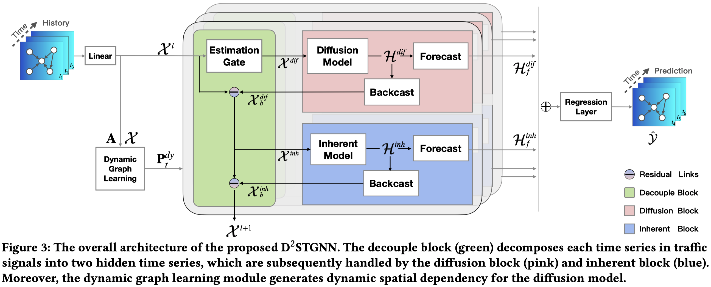
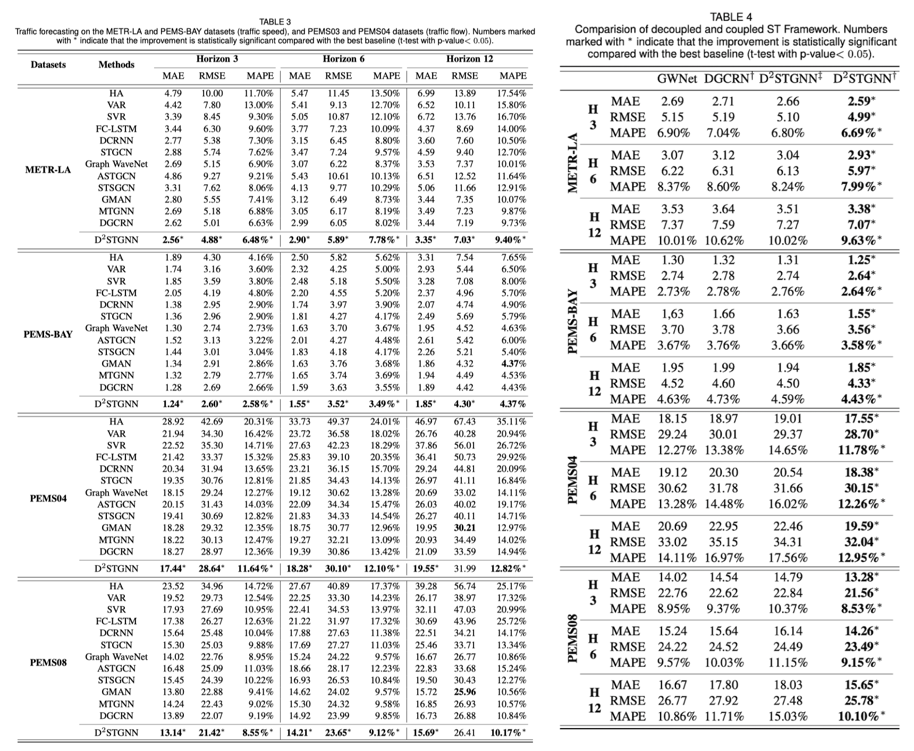
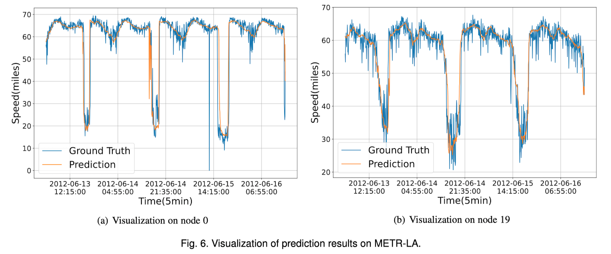

# Decoupled Dynamic Spatial-Temporal Graph Neural Network for Traffic Forecasting

Code for our VLDB'22 paper: "Decoupled Dynamic Spatial-Temporal Graph Neural Network for Traffic Forecasting".



> We all depend on mobility, and vehicular transportation affects the daily lives of most of us. Thus, the ability to forecast the state of traffic in a road network is an important functionality and a challenging task. Traffic data is often obtained from sensors deployed in a road network. Recent proposals on spatial-temporal graph neural networks have achieved great progress at modeling complex spatial-temporal correlations in traffic data, by modeling traffic data as a diffusion process. However, intuitively, traffic data encompasses two different kinds of hidden time series signals, namely the diffusion signals and inherent signals. Unfortunately, nearly all previous works coarsely consider traffic signals entirely as the outcome of the diffusion, while neglecting the inherent signals, which impacts model performance negatively. To improve modeling performance, we propose a novel Decoupled Spatial-Temporal Framework (DSTF) that separates the diffusion and inherent traffic information in a data-driven manner, which encompasses a unique estimation gate and a residual decomposition mechanism. The separated signals can be handled subsequently by the diffusion and inherent modules separately. Further, we propose an instantiation of DSTF, Decoupled Dynamic Spatial-Temporal Graph Neural Network (D2STGNN), that captures spatial-temporal correlations and also features a dynamic graph learning module that targets the learning of the dynamic characteristics of traffic networks. Extensive experiments with four real-world traffic datasets demonstrate that the framework is capable of advancing the state-of-the-art.

## 1. Table of Contents

```text
configs         ->  training Configs and model configs for each dataset
dataloader      ->  pytorch dataloader
datasets        ->  raw data and processed data
model           ->  model implementation and training pipeline
output          ->  model checkpoint
```

## 2. Requirements

```bash
pip install -r requirements.txt
```

## 3. Data Preparation

### 3.1 Download Data

For convenience, we package these datasets used in our model in [Google Drive](https://drive.google.com/drive/folders/1H3nl0eRCVl5jszHPesIPoPu1ODhFMSub?usp=sharing) or [BaiduYun](https://pan.baidu.com/s/1iFcKJ8qeCthyEgPEXYJ-rA?pwd=8888).

They should be downloaded to the code root dir and replace the `raw_data` and `sensor_graph` folder in the `datasets` folder by:

```bash
cd /path/to/project
unzip raw_data.zip -d ./datasets/
unzip sensor_graph.zip -d ./datasets/
rm {sensor_graph.zip,raw_data.zip}
mkdir log output
```

Alterbatively, the datasets can be found as follows:

- METR-LA and PEMS-BAY: These datasets were released by DCRNN[1]. Data can be found in its [GitHub repository](https://github.com/chnsh/DCRNN_PyTorch), where the sensor graphs are also provided.

- PEMS04 and PEMS08: These datasets were released by ASTGCN[2] and ASTGNN[3]. Data can also be found in its [GitHub repository](https://github.com/guoshnBJTU/ASTGNN/tree/main/data).

### 3.2 Data Process

```bash
python datasets/raw_data/$DATASET_NAME/generate_training_data.py
```

Replace `$DATASET_NAME` with one of `METR-LA`, `PEMS-BAY`, `PEMS04`, `PEMS08`.

The processed data is placed in `datasets/$DATASET_NAME`.

## 4. Training the D2STGNN Model

```bash
python main.py --dataset=$DATASET_NAME
```

E.g., `python main.py --dataset=METR-LA`.

## 5 Load a Pretrained D2STGNN Model

Check the config files of the dataset in `configs/$DATASET_NAME`, and set the startup args to test mode.

Download the pre-trained model files in [Google Drive](https://drive.google.com/drive/folders/18nkluGajYET2F9mxz3Kl6jcFVAAUGfpc?usp=sharing) or [BaiduYun](https://pan.baidu.com/s/1tGOdVy4uz5TcvAk5FrR4MQ?pwd=8888) into the `output` folder and run the command line in `1.3`.

## 6 Results and Visualization





## 7. To Do

- [x] Add results and visualization in this readme.
- [x] Add BaiduYun links.
- [x] Add pretrained model.
- [ ] Add reference format.
- [ ] Clean code comments.
- [ ] 添加中文README

## References

[1] Atwood J, Towsley D. Diffusion-convolutional neural networks[J]. Advances in neural information processing systems, 2016, 29: 1993-2001.

[2] Guo S, Lin Y, Feng N, et al. Attention based spatial-temporal graph convolutional networks for traffic flow forecasting[C]//Proceedings of the AAAI Conference on Artificial Intelligence. 2019, 33(01): 922-929.

[3] Guo S, Lin Y, Wan H, et al. Learning dynamics and heterogeneity of spatial-temporal graph data for traffic forecasting[J]. IEEE Transactions on Knowledge and Data Engineering, 2021.
