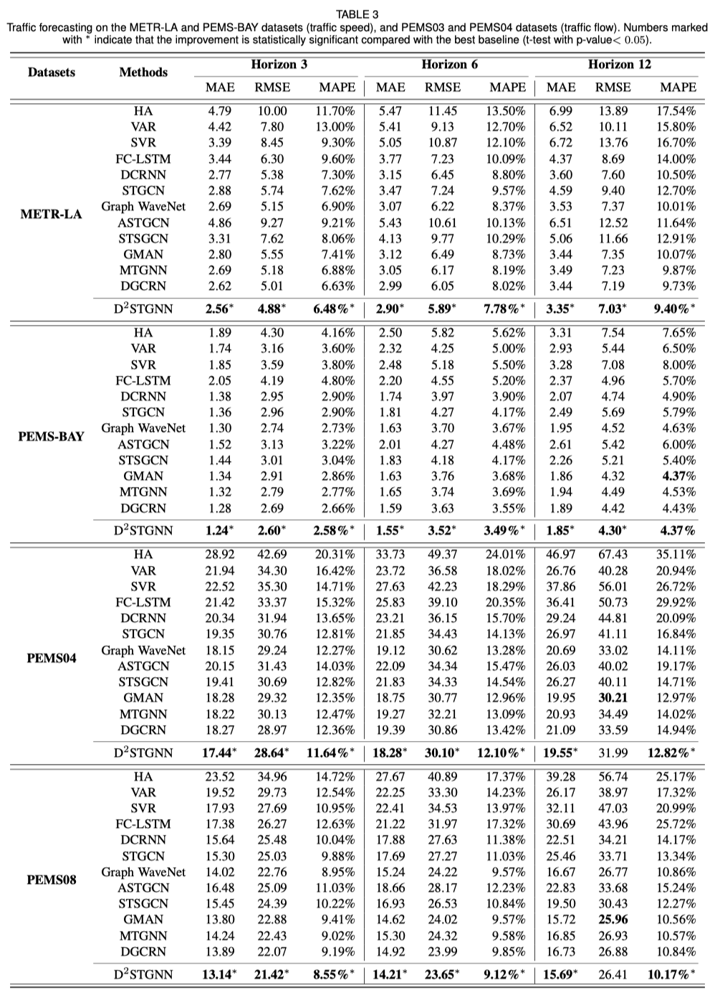
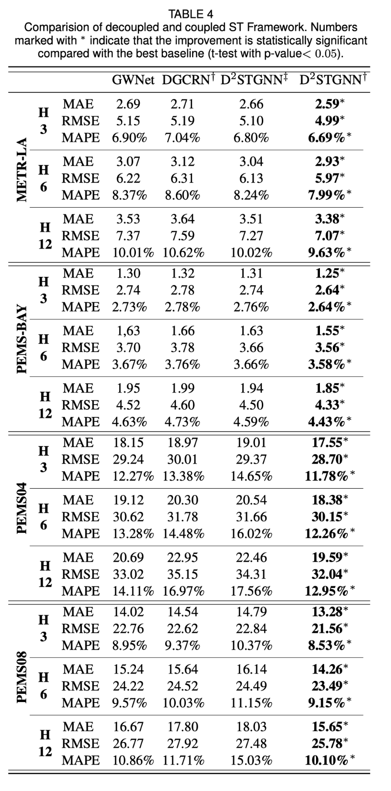

# Decoupled Spatial-Temporal Graph Neural Networks

Code for our paper: Decoupled Dynamic Spatial-Temporal Graph Neural Network for Traffic Forecasting.

> We all depend on mobility, and vehicular transportation affects the daily lives of most of us. Thus, the ability to forecast the state of traffic in a road network is important functionality and an important research topic. Traffic data is obtained from sensors deployed in a road network. After analyzing the traffic data, we find an intuitive assumption of the traffic system: the observation value of a sensor is composed of two underlying parts: (i) the traffic signals diffused from other sensors; (ii) the independent traffic signals of the sensor itself. Recent proposals based on spatial-temporal graph neural networks have shown progress at modeling complex temporal and spatial dependencies in traffic data. However, the serial connection of spatial and temporal models adopted in existing proposals disregards the data assumption, and may lead to the accumulation of errors, which, in turn, impacts model performance negatively.
>
> To improve modeling performance, we propose means of separating the spatial and temporal information in traffic data. Specifically, we propose a novel framework encompassing a unique spatial gate and a residual decomposition mechanism that combine to decouple spatial and temporal information so that this information can be handled subsequently by specialized spatial and temporal modules. The resulting framework, Decoupled Dynamic Spatial-Temporal Graph Neural Network (D 2 STGNN), can capture spatial-temporal dependencies and also features a dynamic graph learning module that targets the learning of the dynamic characteristics of traffic networks. Extensive experiments with four real-world large-scale traffic datasets demonstrate that the framework is capable of advancing the state-of-the-art.

## 1. Run the model and reproduce the result?

### 1.0 Requirements

- numpy==1.20.3
- pandas==1.3.3
- PyYAML==6.0
- scikit_learn==1.0.1
- scipy==1.7.1
- setproctitle==1.2.2
- torch==1.9.1
- torchinfo==1.5.3

Dependency may be installed by the following command:

``` bash
pip install -r requirements.txt
```

### 1.1 Data Preparation

For convenience, we package these datasets used in our model in [Google Drive](https://drive.google.com/drive/folders/1H3nl0eRCVl5jszHPesIPoPu1ODhFMSub?usp=sharing) or [BaiduYun](https://pan.baidu.com/s/1iFcKJ8qeCthyEgPEXYJ-rA?pwd=8888).

They should be downloaded to the code root dir and replace the `raw_data` and `sensor_graph` folder in the `datasets` folder by:

```bash
cd /path/to/project
unzip raw_data.zip -d ./datasets/
unzip sensor_graph.zip -d ./datasets/
rm {sensor_graph.zip,raw_data.zip}
mkdir log output
```

Alterbatively, the datasets can be found as follows:

- METR-LA and PEMS-BAY: These datasets were released by DCRNN[1]. Data can be found in its [GitHub repository](https://github.com/chnsh/DCRNN_PyTorch), where the sensor graphs are also provided.

- PEMS03 and PEMS04: These datasets were released by ASTGCN[2] and ASTGNN[3]. Data can also be found in its [GitHub repository](https://github.com/guoshnBJTU/ASTGNN/tree/main/data).

### 1.2 Data Process

```bash
python datasets/raw_data/$DATASET_NAME/generate_training_data.py
```

Replace `$DATASET_NAME` with one of `METR-LA`, `PEMS-BAY`, `PEMS04`, `PEMS08`.

The processed data is placed in `datasets/$DATASET_NAME`.

### 1.3 Training the Model

```bash
python main.py --dataset=$DATASET_NAME
```

E.g., `python main.py --dataset=METR-LA`.

### 1.4 Load a Pretrained Model

Check the config files of the dataset in `configs/$DATASET_NAME`, and set the startup args to test mode.

Download the pre-trained model files in [Google Drive](https://drive.google.com/drive/folders/18nkluGajYET2F9mxz3Kl6jcFVAAUGfpc?usp=sharing) or [BaiduYun](https://pan.baidu.com/s/1tGOdVy4uz5TcvAk5FrR4MQ?pwd=8888) into the `output` folder and run the command line in `1.3`.

### 1.5 Results and Visualization

<!--  -->


## 2. More QA?

Any issues are welcome.

## 3. To Do

- [x] Add results and visualization in this readme.
- [x] Add BaiduYun links.
- [x] Add pretrained model.
- [ ] 添加中文README

## References

[1] Atwood J, Towsley D. Diffusion-convolutional neural networks[J]. Advances in neural information processing systems, 2016, 29: 1993-2001.

[2] Guo S, Lin Y, Feng N, et al. Attention based spatial-temporal graph convolutional networks for traffic flow forecasting[C]//Proceedings of the AAAI Conference on Artificial Intelligence. 2019, 33(01): 922-929.

[3] Guo S, Lin Y, Wan H, et al. Learning dynamics and heterogeneity of spatial-temporal graph data for traffic forecasting[J]. IEEE Transactions on Knowledge and Data Engineering, 2021.
